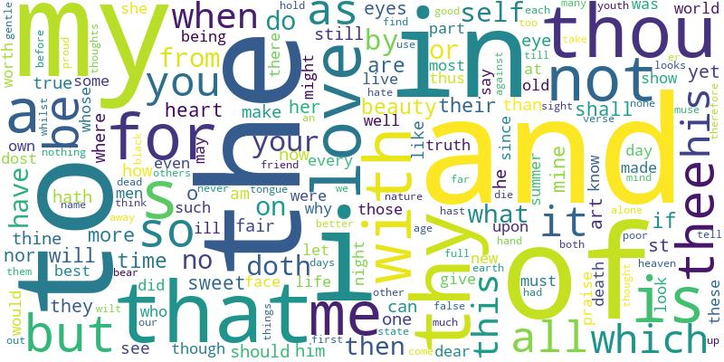

# 셰익스피어 소네트 WordCounting

```python
import sys, re
word_count = sc.textFile('/rdd/shakespeare.txt') \
                            .filter(lambda e : len(e) > 0) \
                            .flatMap(lambda e : re.split('\W+', e)) \
                            .filter(lambda e : len(e) > 0) \
                            .map(lambda e : (e.lower(), 1)) \
                            .reduceByKey(lambda a, b : a + b) \
                            .sortBy(lambda e : e[1], ascending = False)

word_count.collect()

# 단어 별 개수 반환
```

## wordcloud 이용한 시각화

```python
from wordcloud import WordCloud
wc = WordCloud(background_color='white', width=800, height=400)
cloud = wc.generate_from_frequencies(dict(word_count.collect()))
cloud.to_file('/home/big/study/wc.jpg')
```



## nltk 이용한 형태소 분석을 통해 명사만 wordcountong

```python
import nltk

# nltk.download('averaged_perceptron_tagger')
# nltk.download('punkt')

sonnets = sc.textFile('/rdd/shakespeare.txt') \
                        .filter(lambda e : len(e) > 0).collect()

tokens = map(lambda e : nltk.word_tokenize(e), sonnets)
tagged = list(map(lambda e : nltk.pos_tag(e), tokens))
tagged

word_count = sc.parallelize(tagged) \
                    .flatMap(lambda e : e) \
                    .filter(lambda e : e[1] == 'NN') \
                    .map(lambda e : e[0]) \
                    .map(lambda e : (e.lower(), 1)) \
                    .reduceByKey(lambda a, b : a + b) \
                    .sortBy(lambda e : e[1], ascending = False)

word_count.collect()
```

## wordcloud 이용한 명사 시각화

```python
wc = WordCloud(background_color='white', width=800, height=400)
cloud = wc.generate_from_frequencies(dict(word_count.collect()))
cloud.to_file('/home/big/study/wc2.jpg')
```


### 결론 : 소네트는 사랑에 대한 이야기를 하는 시이다.