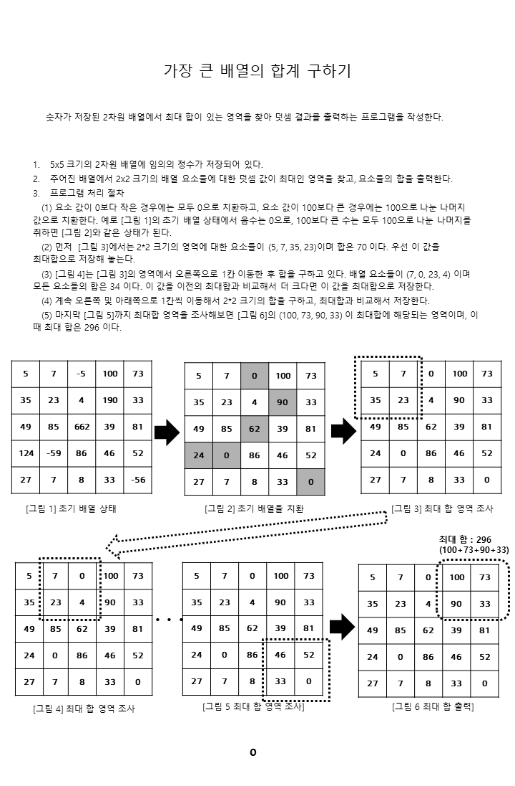

```python
ARRAY_LENGTH = 5  # 배열의 행과 열 크기(고정)

def replaceData(numData): # numData	2차원 정수 배열
    retData = [] # 조건에 따라서 전처리된 2차원 배열

    ###########   여기부터 코딩 (1) ---------------->
    for i in range(5) :
        for j in range(5) :
                if (numData[i][j] < 0):
                        numData[i][j] = 0
                if (numData[i][j] > 100):
                        numData[i][j] = numData[i][j] % 100
    retData = numData


    ###########   <-------------- 여기까지 코딩 (1)

    return retData


# 2x2 크기의 배열의 최대합을 구한다.
def getMaxSum(numData): # 요구 사항에 맞춰 처리된 2차원 정수 배열
    maxSum = 0 # 최대합

    ###########   여기부터 코딩 (2) ---------------->
    for i in range(ARRAY_LENGTH - 1):
        for j in range(ARRAY_LENGTH - 1):
                temp = numData[i][j] + numData[i + 1][j] + numData[i][j + 1] + numData[i + 1][j + 1]
                if (temp > maxSum):
                        maxSum = temp


    ###########   <-------------- 여기까지 코딩 (2)

    return maxSum

## 전역 변수 선언 부분
numData =[] # 5x5 배열
ARRAY_LENGTH = 5 # 배열의 행과 열 크기(고정)

def main() :
        global numData

        loadData() # 2차원 배열 읽어오기

        ## 원본 출력
        print(' ----- 초기 배열 -----')
        printData()

        # 1. 데이터 치환 작업
        numData = replaceData(numData)
        print(' ----- 치환 후 배열 -----')
        printData()

        # 2. 최대 합 구하기.(2x2 크기)
        maxSum = getMaxSum(numData)
        print('최대 영역의 합: %d' % maxSum)

       
## 함수 선언 부분
def  loadData() : # 데이터 불러오기
    global numData

    ###########
    # 제공 데이터 세트 1 
    # 5x5 숫자 배열. 
    ###########
    numData = \
    [
        [ 5, 7, -5, 100, 73 ],
        [ 35, 23, 4, 190, 33 ],
        [ 49, 85, 662, 39, 81 ],
        [ 124, -59, 86, 46, 52 ],
        [ 27, 7, 8, 33, -56 ] 
    ]
    
    

def printData() :
        for i in range(0, ARRAY_LENGTH) :
                for k in range(0, ARRAY_LENGTH) :
                        try :
                                print("%5d" % numData[i][k], end='')
                        except :
                                pass
                print()
        print('--------------------------------------')

## 메인 함수 호출 ##
if __name__ == "__main__" :
    main()

'''
 ----- 초기 배열 -----
    5    7   -5  100   73
   35   23    4  190   33
   49   85  662   39   81
  124  -59   86   46   52
   27    7    8   33  -56
--------------------------------------
 ----- 치환 후 배열 -----
    5    7    0  100   73
   35   23    4   90   33
   49   85   62   39   81
   24    0   86   46   52
   27    7    8   33    0
--------------------------------------
최대 영역의 합: 296
'''
```